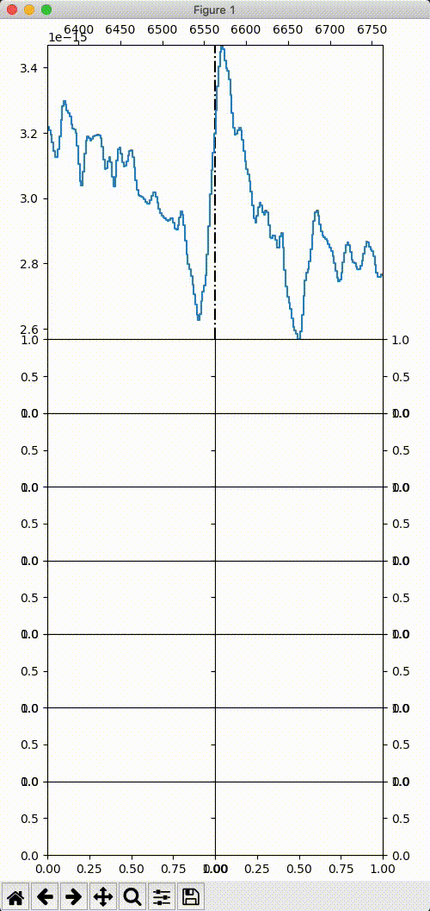

.. _advancedexamples:

Basic Example
========================

Simple usage
~~~~~~~~~~~~~~~~~~~~~~~~~~~~~~~

In here we show how to use spectrum-fitting in the simplest way possible.

.. code:: python

	interaction.py data/trim_SN2016bkv_20160402_redblu_100752.769.fits -l 6563 -p pcygbc

This will attempt to fit a P Cygni profile with a blue continuum (``pcygbc``) to the Hα line (at 6563 Å) in the spectrum you provide.
To see other line profiles and other optional parameters, run ``interaction.py -h``.

